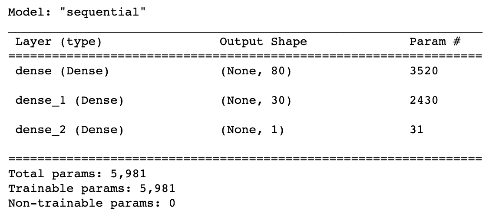
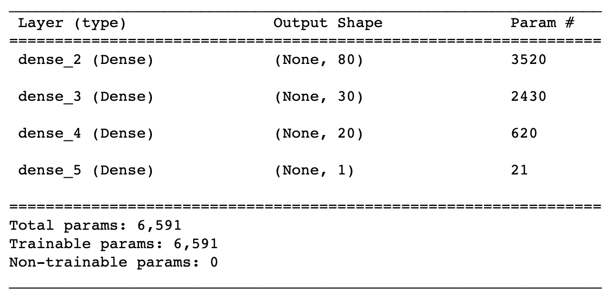
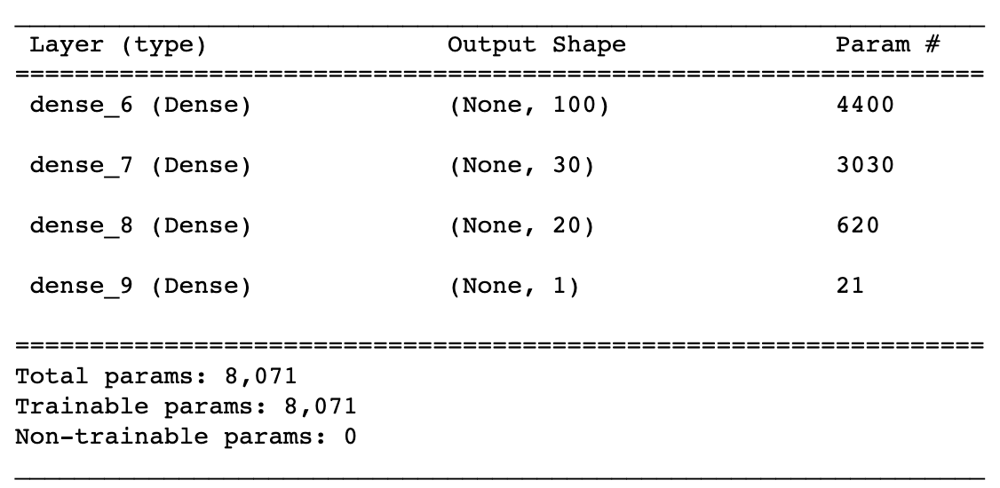
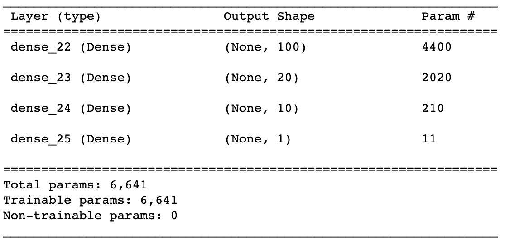

# Report on the Neural Network Model

## Overview of Analysis

The purpose of this analysis is to predict if whether or not an applicant for funding will be successful if funded by Alphabet Soup. The features in the dataset, a CSV containing more than 34,000 organizations that have received funding from Alphabet Soup over the years, were used to create a binary classifier that is capable of making such predication. 

## Results

### Data Preprocessing

* Variable(s) considered as the target(s) for the model: 'IS_SUCCESSFUL.'

* Variable(s) considered to be the feature(s) for the model: 
    * APPLICATION_TYPE
    * AFFILIATION
    * CLASSIFICATION
    * USE_CASE
    * ORGANIZATION
    * STATUS
    * INCOME_AMT
    * SPECIAL_CONSIDERATIONS
    * ASK_AMT

* Variable(s) that are neither targets nor features removed from the input data:
    * EIN
    * NAME

### Compiling, Training, and Evaluating the Model

* The number of neurons, layers, and activation functions selected for the neural network model and performance outcome:

* Model 1

Loss: 0.5661807656288147, Accuracy: 0.7281632423400879

* Model 2

Loss: 0.5788002014160156, Accuracy: 0.7238484025001526

* Model 3

Loss: 0.5627278685569763, Accuracy: 0.7282798886299133

* Model 4

Loss: 0.5630417466163635, Accuracy: 0.7295626997947693

* The steps taken to try and increase the model performance were to add one additional hidden layer for a total of three hidden layers for attempts 2 through 4, increase the nodes for one layer and vary the epochs per attempt. 

## Summary

The overall results of the deep learning model did not reach the targeted accuracy of 75%. Following three (3) attempts to optimize the model, accuracy remained at approximately 72%. A recommendation for a different model that could solve this classification problem would be to use Random Forest or Logistic Regression to predict if whether applicants will be successful if funded by Alphabet Soup. A neural network may not be the best algorithm to solve this issue. 
